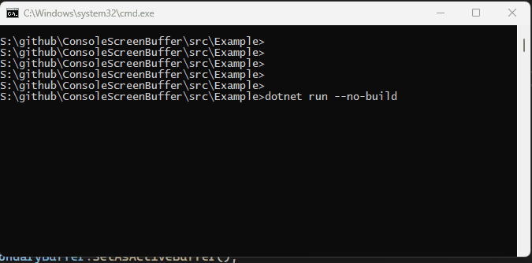

# ConsoleScreenBuffer
Class which makes dotnet Console API on windows work with an alternate screen buffer.

# Install

```dotnet add package ConsoleScreenBuffer```


# Usage

The **ConsoleScreenBuffer** class gives you the ability to create console screen buffers, and switch between them easily.

* **To Capture Current Buffer** 
  *  ```ConsoleScreenBuffer.GetCurrent()```
* **To Create an alternate buffer** 
  *  ```ConsoleScreenBuffer.Create()```
* **To Activate a buffer**  -
  * ```buffer.SetAsActiveBuffer()``` All of the Console API's will use the new screen buffer seamlessly.



# Example

```csharp
Console.WriteLine("Hello, World!");
// capture the original screen buffer
var originalBuffer = ConsoleScreenBuffer.GetCurrent();

// create an alternate screen buffer
var buffer = ConsoleScreenBuffer.Create(true);

// make it active
buffer.SetAsActiveBuffer();

// use Console API.
Console.SetCursorPosition(10, 2);
Console.ForegroundColor = ConsoleColor.Yellow;
Console.Write("Hello secondary buffer!");
Console.ReadKey(true); // wait for a keypress

// restore original screen
originalBuffer.SetAsActiveBuffer();
Console.WriteLine("All done");

```

